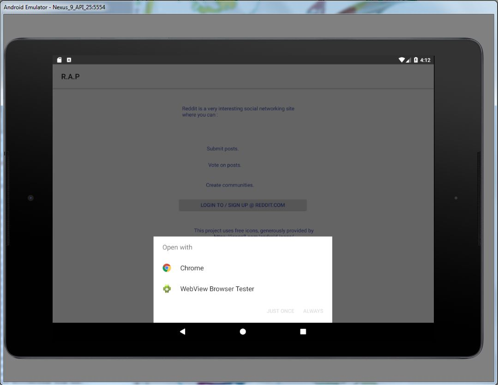
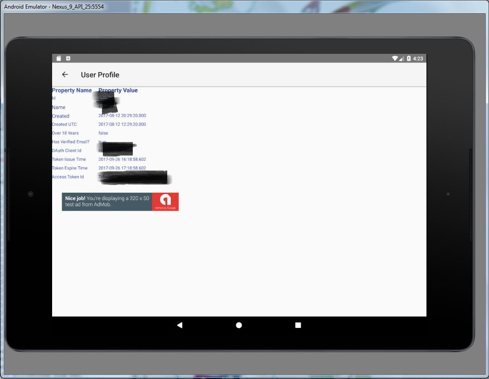

## Udacity Android Developer Nano Degree Project : R.A.P (Reddit App Project)

### This is a final project submitted for Android Developer  Nano degree :

### R.A.P features include : 

* -Implements OAuth 2 authentication flow with reddit.com
* -Uses JSON APIs provided by reddit.com
* -Uses GSON to parse the JSON responses from reddit.com
* -As a solution , it presents a single, unified, and balanced view of all the subreddits subscribed by user.
* -Uses SimpleExoPlayer player to play .mp4 content if url ends with .mp4 and other supported media .
* -Uses image view to images if the url ends wth known image types.
* -Uses systems browser to view all other content including comments.
* -Implements Master Detail Activity
* -Uses Google play service :  Admob service
* -uses Google play servcie : Google Analytics

### This project includes :

 * -debug and release builds with signing config
 * -includes only Free App version.
 
### Evaluation / Testing Instructions

* -Build and Install the Apk 
* -You will need an account with reddit.com to test/use R.A.P App.
* -After login at reddit.com, you will be returned to the R.A.P .
   Use R.A.P as the  handler when you are given choices between Goole Chrome (or other browsers ) and  R.A.P . 
* -Please use the following Phone / Tablet screen shots for OAuth flow (reddit.com login) handling 
   
* -It is very likely that you may not come across reddit posts that can be handled by SimpleExoPlayer.
* -Testing of SimpleExoplayer can be achived by editing lines 296 - 298 in ui/RedditPostListActivity.java .
   Just follow the instructions given in the source code itself.. You have to comment one line  and uncomment the hard coded .mp4 URL.
   Build, Install and test.

 
### R.A.P App Phone Screen Shots

### R.A.P App Tablet Screen Shots

### R.A.P App related browser screen shots from Google Analytics & Firebase

